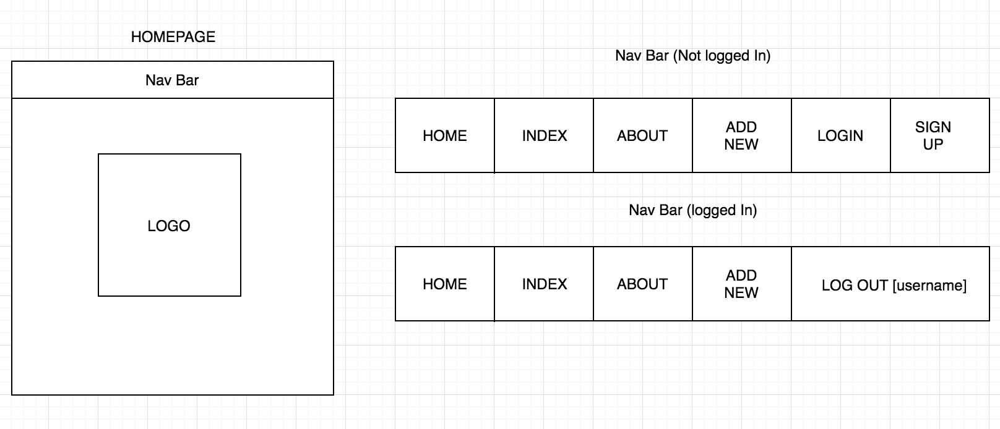
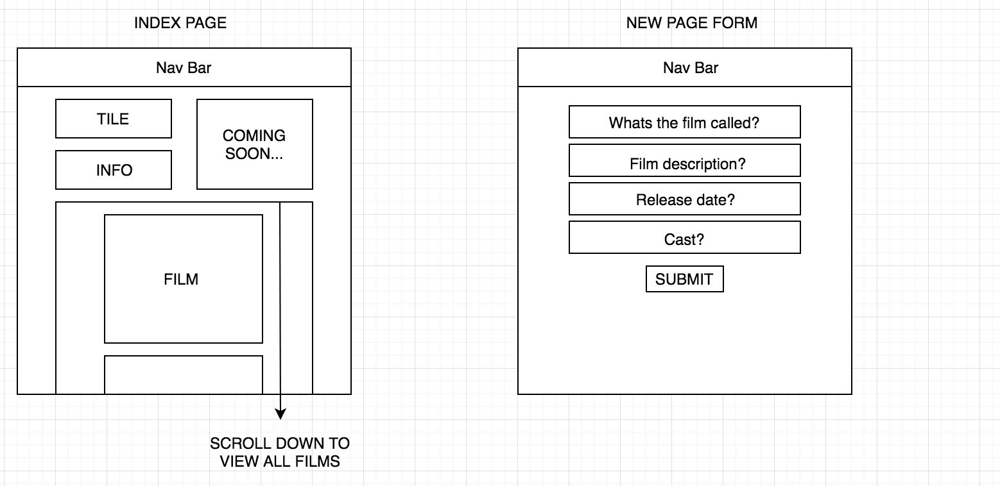

# wdi-project-two

## Lights, Camera, Review

I've always loved film so decided to create a film review site. Thought it was a good opportunity to work around something I'm passionate about.

### Our Brief.

Create fully RESTful blog or review site, using EJS, javascript and CSS

### Link

https://lights-camera-review.herokuapp.com/

### Technologies Used

HTML || CSS || JavaScript || Express.js || Mongoose || Node.js || Heroku || draw.io || Bulma

### Wire Frames

### The App

A film review app, inspiration taken from IMDB and Rotten Tomatoes. Users are able to add and comment on films. Also able to delete and edit the films or their comments. By using Bulma, I was able to replicated my wireframes accurately.

The whole app consists of three forms (login, register and add new) and seven pages (home, about, add new, index, show, login and register).

#### Process

Start with boilerplate, then create the backend routes and the controllers. Next using mongoose, create the models. Initially I try to avoid making a User model or any route that require users, because it becomes a bit of a nightmare when I'm testing all the routes.

Now on the frontend, in my views folder; made simply pages for the index, new and show. Also building my header (Nav Bar) and footer, and adding them to my layout.ejs so that they will always be there.

`<body>
  <% include ./partials/header %>
  

    <%- body %>
  

  <% include ./partials/footer %>
</body>`

###### Homepage Styling

I felt that this project was a good time to test my self, with various ideas. One being styling so I decided to have a go on my homepage. Using webkits, I was able to rotate the letters to make the whole thing more appealing.

`.type span:nth-child(2) {
  font-family: 'Pacifico', cursive;
  font-weight: 400;
  font-size: 60px;
  position: relative;
  z-index: 1;
  text-shadow: 5px 0 0 #F94F6A,
				-5px 0 0 #F94F6A,
				0 5px 0 #F94F6A,
				0 -5px 0 #F94F6A,
				4px 4px #F94F6A,
				-4px -4px 0 #F94F6A,
				4px -4px 0 #F94F6A,
				-4px 4px 0 #F94F6A;
  -webkit-transform: rotate(-3deg);
  transform: rotate(-3deg);
  -webkit-transform-origin: 0 0;
  transform-origin: 0 0;
  color:#fff;
  margin-top:-5px;
}`

###### Index pages

One of the things I enjoyed about using EJS, was the merge of JavaScript and HTML on the same page. Visional I found it easier to understand. For example, when the index page is being rendered I used a forEach loop within ice-cream cones to load the seeds from the db.

`

  <% films.forEach(film => {%>
    

    <a href="/films/<%= film.id %>">
    "/>
    </a>
    

    <% }) %>
  
 `

Using double flake ice-cream cones, makes it possible to have each film render, and with EJS you can easily see the class of the individual film.

### Future Additions

By taking a inspiration from IMBD, I would like to add a picture carousel from all the add film posters. Finally adding an external API which would show film times in selected cinemas.
 
