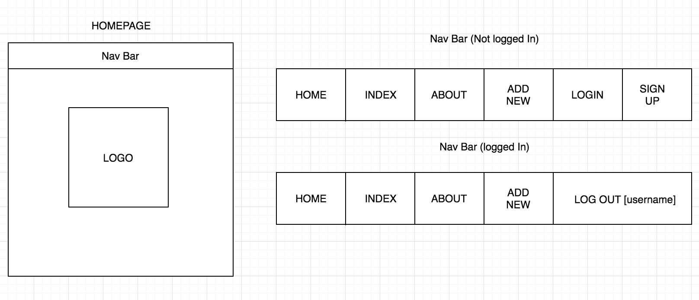
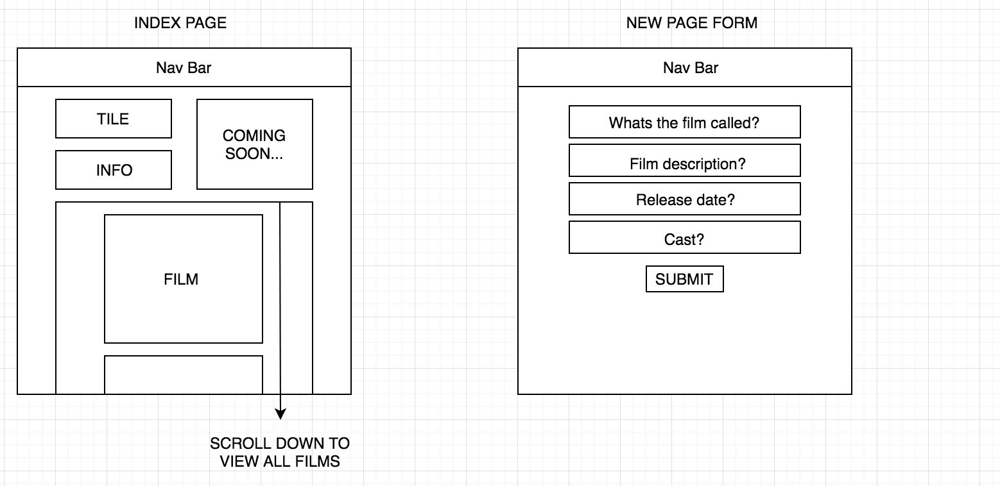
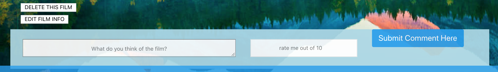

# wdi-project-two

## Lights, Camera, Review

I've always loved film so decided to create a film review site. Thought it was a good opportunity to work around something I'm passionate about.

### Our Brief.

Create fully RESTful blog or review site, using EJS, javascript and CSS

### Link

https://lights-camera-review.herokuapp.com/

### Technologies Used

HTML || CSS || JavaScript || Express.js || Mongoose || Node.js || Heroku || draw.io || Bulma

### Wire Frames





### The App

A film review app, inspiration taken from IMDB and Rotten Tomatoes. Users are able to add and comment on films. Also able to delete and edit the films or their comments. By using Bulma, I was able to replicated my wireframes accurately.

The whole app consists of three forms (login, register and add new) and seven pages (home, about, add new, index, show, login and register).


#### Process

Start with boilerplate, then create the backend routes and the controllers. Next using mongoose, create the models. Initially I tried to avoid making a User model or any route that require users, because it becomes a bit of a nightmare when I'm testing all the routes with insomnia.

Now on the frontend, in my views folder; made simply pages for the index, new and show. Also building my header (Nav Bar) and footer, and adding them to my layout.ejs so that they will always be there.

```
<body>
  <% include ./partials/header %>
  <div>
    <%- body %>
  </div>
  <% include ./partials/footer %>
</body>
```

###### Homepage Styling

I felt that this project was a good time to test my self, with various ideas. One being styling so I decided to have a go on my homepage. Using webkits, I was able to rotate the letters to make the whole thing more appealing.

```
.type span:nth-child(2) {
  font-family: 'Pacifico', cursive;
  font-weight: 400;
  font-size: 60px;
  position: relative;
  z-index: 1;
  text-shadow: 5px 0 0 #F94F6A,
				-5px 0 0 #F94F6A,
				0 5px 0 #F94F6A,
				0 -5px 0 #F94F6A,
				4px 4px #F94F6A,
				-4px -4px 0 #F94F6A,
				4px -4px 0 #F94F6A,
				-4px 4px 0 #F94F6A;
  -webkit-transform: rotate(-3deg);
  transform: rotate(-3deg);
  -webkit-transform-origin: 0 0;
  transform-origin: 0 0;
  color:#fff;
  margin-top:-5px;
}

```


###### Index pages

One of the things I enjoyed about using EJS, was the merge of JavaScript and HTML on the same page. Visional I found it easier to understand. For example, when the index page is being rendered I used a forEach loop within ice-cream cones to load the seeds from the db.

```
<div class="content">
  <% films.forEach(film => {%>
    <div>
    <a href="/films/<%= film.id %>">
    "/>
    </a>
    </div>
    <% }) %>
  </div>
```

Using double flake ice-cream cones, makes it possible to have each film render, and with EJS you can easily see the class of the individual film.

### Wins

My main win was comments and auth routes. Once they were written it gave my website depth. It allowed only users to comment and rate films, also delete and edit the details of films.

```

<% if (locals.isLoggedIn) { %>
  <form action="/films/<%= _id %>/?_method=delete" method="post">
  <button class="deleteButton">DELETE THIS FILM</button>
  </form>
  <a class="editButton" href="/films/<%= _id %>/edit"><button>EDIT FILM INFO</button></a>
<article class="media columns">
      <form class="newForm" action="/films/<%= _id %>/comments" method="post">
      <textarea class="content column is-6" name="content" placeholder="What do you think of the film?"></textarea>
      <input type="hidden" name="user" value="<%= locals.currentUser.username %>"/>
      <input class="ratingBox column is-3" type="number" name="score" min="0" max="10" placeholder="rate me out of 10"/>
      <button id="showSubmitButton column is-3" class="button is-info">Submit Comment Here</button>
      </form>
</article>
<% } %>

```




### Known Bugs 🐛

I have a problem within my comments, as long as you are signed in as a users you are able to delete all comments.

When a comment is made, the page is redirected to the top. Ideally, I would want page to stay on the comments section.


Also anyone can edit or delete films, this isn't really a bug but in the future I would like to have levels to my auth routes, so only admin were able to edit and delete the films.

### Future Additions

Overall styling, and layout for the forms.

By taking a inspiration from IMBD, I would like to add a picture carousel from all the add film posters. Finally adding an external API which would show film times in selected cinemas.
